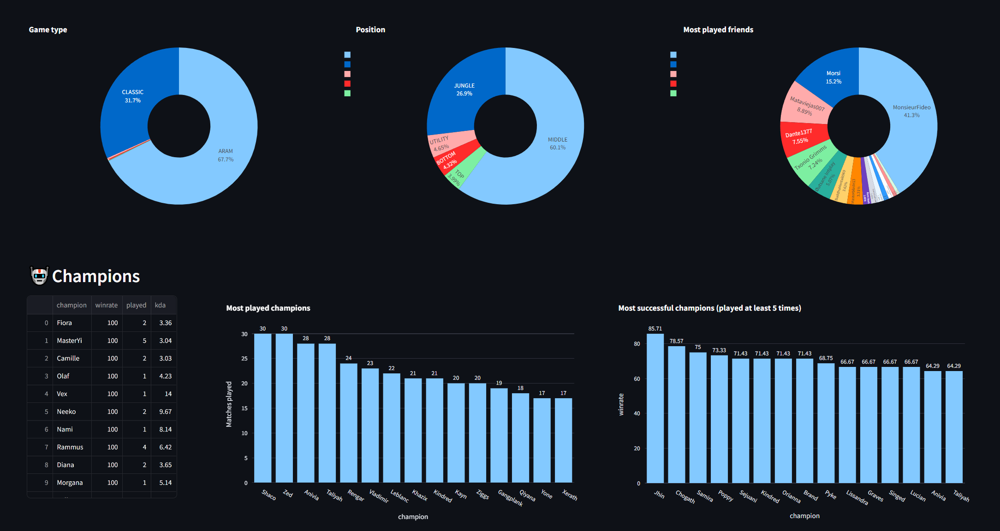

# LoL personal advisor
I have played league of legends ocassionally since the beta was released. I thought to build some fun project with my data about the game.



## Description
First some [tools](./league.py) to extract data from the League of Legends API, wich should make connecting and extracting data a 4 line thing.
```python
api = RiotAPI(config)
league = League("sumonername", api)
last_match = league.get_matches(count=1)
last_match_info = league.get_match_info(last_match[0])
```
Built a database using DuckDB as a showcase.  
Display results in a Streamlit app
## Ideas for the future

- DuckDB
- Heat map of position on the map
- All historic players
- Who do I win most with?
- Are there players that I have crossed many times?
- Basic statistics about champions and style I play
- Playing patterns, is there a specific time I win more?
- Build a forecasting model on if I will win or lose a match based on the champs played

- Lore and items. What fits me best?
- Maybe Vectorsearch for something related to the lol lore/champs


## Database
- 1 for Historic matches (1 entry per match)
- 1 for match timelines
- 1 for players encountered 1 row per player, champion played , date and id of match

## License
Using League of Legends API developer key.  
**Disclaimer:**   
This project is intended as a showcase on how to use the API. If you use the code you should follow the 
[Riot developer portal](https://developer.riotgames.com/) information on how to use their API and data.